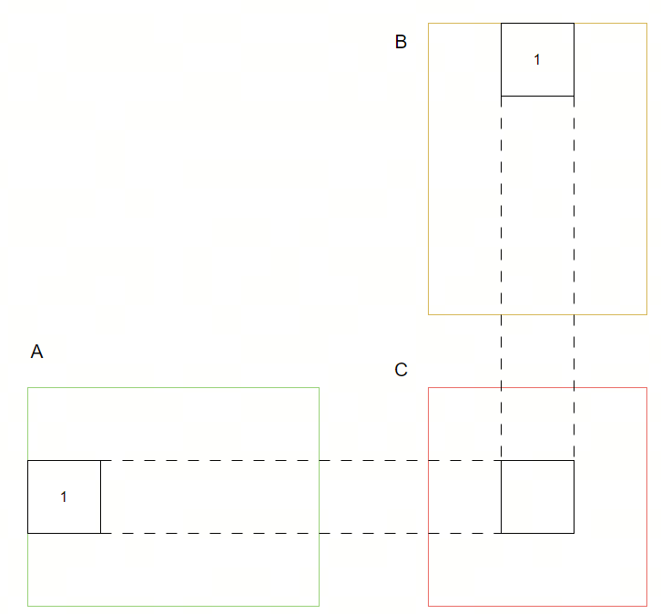
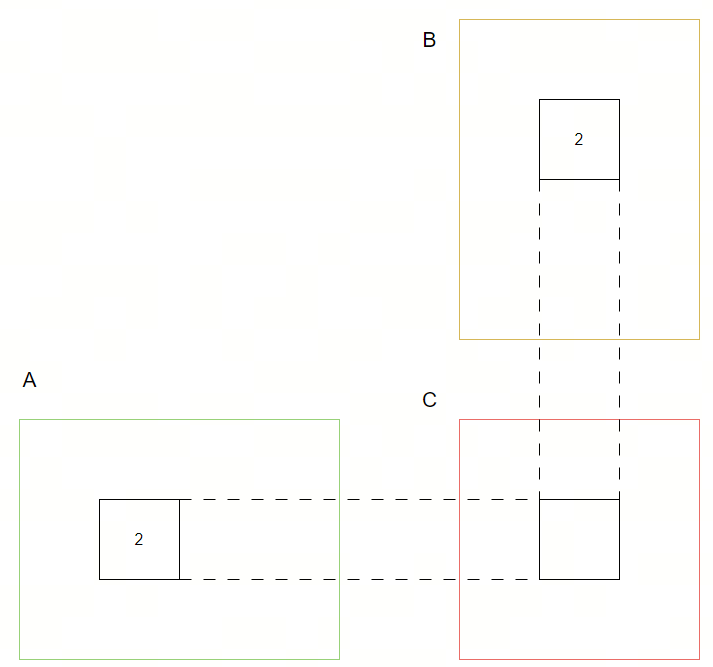

# tile based 矩阵乘法
在深度学习领域，全连接层，transformer网络里面的 \\(QK^t\\) 都是矩阵乘法。一般意义上的矩阵乘法:
$$
𝐴_{𝑚×k}𝐵_{k×n} = 𝐶_{m×n}
$$
其中C的单个元素表示：
$$
c_{ij} = \sum_{p=1}^{k} a_{ip} * b_{pj}
$$

### 不使用shared memory的简单办法
如果使用简单的cuda实现：
```cpp
__global__ void matmul(float* A, float* B, float* C, int m, int k, int n)
{
    // Thread index
    int tx = threadIdx.x + blockDim.x * blockIdx.x;
    int ty = threadIdx.y + blockDim.y * blockIdx.y;
    if (tx >= n || ty >= m)
    {
        return;
    }
    float csub = 0.0f;
    for(int p = 0; p < k; p++)
    {
        csub += A[ty*k+p] * B[p*n+tx];
    }
    C[ty*n + tx] = csub;
}
```
这个实现最大的性能问题是每一个thread都需要访问 2 * k次global memory，而且相邻的thread对global memory的访问其实是overlap的，这里存在严重的global memory latency浪费。

### 使用shared memory的简单办法
然后很自然的我们发展出第二种实现：
```cpp
__global__ void matmul(float* A, float* B, float* C, int m, int k, int n)
{
    __shared__ float As[TILE][k];
    __shared__ float Bs[TILE][k];
    // Thread index
    int tx = threadIdx.x + blockDim.x * blockIdx.x;
    int ty = threadIdx.y + blockDim.y * blockIdx.y;
    if (tx >= n || ty >= m)
    {
        return;
    }
    int tile_idx = tx % TILE;
    int tile_idy = ty % TILE;
    // 搬运数据到shared memory
    for(int tile_x=tile_idx; tile_x<k; tile_x+=TILE)
    {
        As[tile_idy][tile_x] = A[ty*k+tile_x];
    }
    for(int tile_y=tile_idy; tile_y<k; tile_y+=TILE)
    {
        Bs[tile_idx][tile_y] = B[(ty+tile_y)*n+tx];
    }
    __syncthreads();
    float csub = 0.0f;
    for(int p = 0; p < k; p++)
    {
        csub += As[tile_idy][p] * Bs[tile_idx][p];
    }
    C[ty*n + tx] = csub;
}
```
这个实现利用shared memory来缓存重复利用的A行B列，达到相邻thread重复利用memory的目的，但是它的问题在于：
1. k长度如果很大，则shared memory可能装不下导致SM驻留block减小，达不到隐藏memory延迟的的目的。
2. 每一个thread要访问 2 * k / TILE次global memory，计算必须等到数据完全搬运完成之后才能开始。

### 使用shared memory的tile方法
这里注意到一个事实: k次乘法可以分为若干个局部乘法然后把结果累加起来，这样就可以避免shared memory不足问题，具体来说可以用如下图片示意：



依次类推，每一次计算都是从AB矩阵搬运部分数据到shared memory，然后做依次局部乘法，把结果累加起来。
```cpp
// wA表示矩阵A的宽度， wB表示矩阵B的宽度
template <int BLOCK_SIZE> __global__ void MatrixMulCUDA(float *C, float *A, float *B, int wA, int wB)
{
  // Declaration of the shared memory array As used to
  // store the sub-matrix of A
  __shared__ float As[BLOCK_SIZE][BLOCK_SIZE];
  // Declaration of the shared memory array Bs used to
  // store the sub-matrix of B
  __shared__ float Bs[BLOCK_SIZE][BLOCK_SIZE];
  // Block index
  int bx = blockIdx.x;
  int by = blockIdx.y;
  // Thread index
  int tx = threadIdx.x;
  int ty = threadIdx.y;
  // Index of the first sub-matrix of A processed by the block
  int aBegin = wA * BLOCK_SIZE * by;
  // Index of the last sub-matrix of A processed by the block
  int aEnd   = aBegin + wA - 1;
  // Step size used to iterate through the sub-matrices of A
  int aStep  = BLOCK_SIZE;
  // Index of the first sub-matrix of B processed by the block
  int bBegin = BLOCK_SIZE * bx;
  // Step size used to iterate through the sub-matrices of B
  int bStep  = BLOCK_SIZE * wB;
  // Csub is used to store the element of the block sub-matrix
  // that is computed by the thread
  float Csub = 0;
  // Loop over all the sub-matrices of A and B
  // required to compute the block sub-matrix
  for (int a = aBegin, b = bBegin;
       a <= aEnd;
       a += aStep, b += bStep) {


    // Load the matrices from device memory
    // to shared memory; each thread loads
    // one element of each matrix
    As[ty][tx] = A[a + wA * ty + tx];
    Bs[ty][tx] = B[b + wB * ty + tx];
    // Synchronize to make sure the matrices are loaded
    __syncthreads();
    // Multiply the two matrices together;
    // each thread computes one element
    // of the block sub-matrix
#pragma unroll
    for (int k = 0; k < BLOCK_SIZE; ++k) {
      Csub += As[ty][k] * Bs[k][tx];
    }
    // Synchronize to make sure that the preceding
    // computation is done before loading two new
    // sub-matrices of A and B in the next iteration
    __syncthreads();
  }
  // Write the block sub-matrix to device memory;
  // each thread writes one element
  int c = wB * BLOCK_SIZE * by + BLOCK_SIZE * bx;
  C[c + wB * ty + tx] = Csub;
}
```