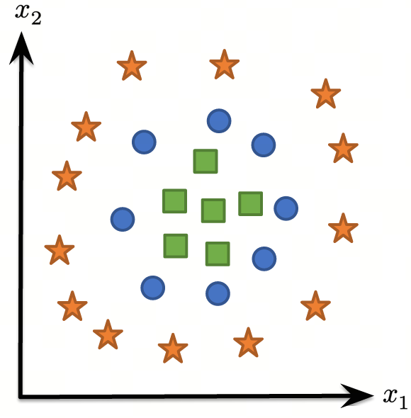
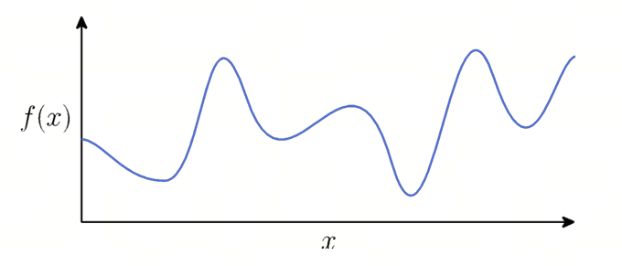
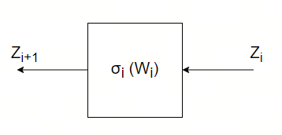
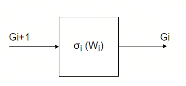

# 手工神经网络
pdf地址：[这里](https://dlsyscourse.org/slides/manual_neural_nets.pdf) 

## 线性层和非线性层
前面的分类网络中，线性转换\\(\theta\\)只能把一个向量从一个线性空间转换到另一个线性空间，结果仍然是线性的。如果输入不满足线性分布，则线性转换难以拟合这个分类过程。 

比如这个数据分布靠线性转换是不可能做到高质量分类的：

堆叠线性转换是否可以做到呢？**不可以**，因为：
$$
h_{\theta} = \theta^{T}W^{T}x = \tilde{\theta}^{T}x
$$
结果仍然是一个线性转换。

非线性层转换很简单，它不改变输入的维度，仅仅做一个点对点的非线性操作：
$$
\phi(x) = \sigma(W^{T}x) \\\\
W^{T} \in \mathbb{R}^{d \times n}, x \in \mathbb{R}^{n \times 1} \\\\
\sigma: \mathbb{R}^{d \times 1} \to \mathbb{R}^{d \times 1}
$$

## 神经网络
简单讲，就是把众多运算层组合起来的一个结构，线性层，非线性层.... 
一个简单的2层网络：
$$
\phi(x) = W_{2}^{T}\sigma(W_{1}^{T}x) \\\\
x \in \mathbb{R}^{n \times 1} \\\\
W_{1}^{T} \in \mathbb{R}^{d \times n} \\\\
W_{2}^{T} \in \mathbb{R}^{k \times d}
$$
\\(\sigma\\)是两个线形层中间的非线性层：
$$
\sigma: \mathbb{R}^{d \times 1} \to \mathbb{R}^{d \times 1}
$$
它可以是`sigmod`或者`ReLU`之类的非线性层。
$$
sigmod(x) = \frac{1}{1+e^{-x}} \\\\
ReLU(x) = \max(0, x)
$$

### 为什么线性叠加非线性能拟合任意光滑的函数
假设目标函数是光滑函数\\(f: \mathbb{R} \to \mathbb{R}\\)，输入\\(x \in \mathbb{R}\\)且处于闭区间\\(\mathcal{D}\\)（输入值范围有限），我们构造的网络拟合函数是\\(\widehat{f}\\)，需要证明\\(\widehat{f}\\)能满足误差：
$$
\max_{x \in \mathcal{D}}|f(x) - \widehat{f}(x)| < \epsilon
$$
说明如下：
1. 采样点足够密
2. 分段线性函数
3. 原函数光滑，没有突变

那么就可以视作通过多段线性+非线性来拟合：
$$
\widehat{f}(x) = \sum_{i=1}^{d} \pm \max(0, w_{i}x+b_{i})
$$
`d`表示分段数量。

### 全连接层网络
也叫多层感知机（Multi-layer perceptron）。
$$
Z_{1} = X \\\\
Z_{2} = \sigma_{1}(Z_{1}W_{1}) \\\\
Z_{3} = \sigma_{2}(Z_{2}W_{2}) \\\\
...\\\\
h_{\theta}(X) = Z_{L+1} \\\\
\theta = \\{W_{1}, ... W_{L}\\}
$$

## 反向传播
还是拿两层全连接网络作为例子，优化参数为\\(W_{1}, W_{2}\\)，其导数为:
$$
\nabla_{\\{W_1, W_2\\}}l_{ce}(\sigma(XW_{1})W_{2}, y)
$$
对\\(W_2\\)求导：
$$
\frac{\partial l_{ce}(\sigma(XW_1)W_2, y)}{\partial W_2} = \frac{\partial l_{ce}(\sigma(XW_1)W_2, y)}{\partial \sigma(XW_1)W_2} \cdot \frac{\partial \sigma(XW_1)W_2}{\partial W_2}\\\\
= (S - I_y) \cdot (\sigma(XW_1)) \\\\
S = normalize(\exp(\sigma(XW_1)W_2))
$$
最终组合维度的结果就是：
$$
\frac{\partial l_{ce}(\sigma(XW_1)W_2, y)}{\partial W_2} = \sigma(XW_1)^{T}(S - I_y)
$$

对\\(W_1\\)求导：
$$
\frac{\partial l_{ce}(\sigma(XW_1)W_2, y)}{\partial W_1} = \frac{\partial l_{ce}(\sigma(XW_1)W_2, y)}{\partial \sigma(XW_1)W_2} \cdot \frac{\partial \sigma(XW_1)W_2}{\partial \sigma(XW_1)} \cdot \frac{\partial \sigma(XW_1)}{\partial XW_1} \cdot \frac{\partial XW_1}{\partial W_1} \\\\
= (S - I_y) \cdot (W_2) \cdot (\sigma^{\'}(XW_1)) \cdot (X)
$$
维度组合后：
$$
\frac{\partial l_{ce}(\sigma(XW_1)W_2, y)}{\partial W_1} = X^T((S - I_y)W_{2}^{T} \circ \sigma^{\'}(XW_{1}))
$$
\\(\circ\\)表示element-wise乘法。

这样计算非常的繁琐，没有人能够在神经网络由多层运算层构成的情况下写对求导公式，所以链式法则逐个计算非常的重要，重新考虑全连接层的表达方式：
$$
Z_{1} = X \\\\
Z_{2} = \sigma_{1}(Z_{1}W_{1}) \\\\
Z_{3} = \sigma_{2}(Z_{2}W_{2}) \\\\
Z_{i+1} = \sigma_{i}(Z_{i}W_{i})
$$
loss对任意一层的\\(W_i\\)求导可得：
$$
\frac{\partial l(Z_{L+1}, y)}{\partial W_i} = \frac{\partial l}{\partial Z_{L+1}} \cdot \frac{\partial Z_{L+1}}{\partial Z_{L}} \cdot \frac{\partial Z_{L}}{\partial Z_{L-1}} \cdot ... \cdot \frac{\partial Z_{i+2}}{\partial Z_{i+1}} \cdot \frac{\partial Z_{i+1}}{\partial W_i} \\\\
= \frac{\partial l(Z_{L+1}, y)}{\partial Z_{i+1}} \cdot \frac{\partial Z_{i+1}}{\partial W_i}
$$
设：
$$
G_{i+1} = \frac{\partial l(Z_{L+1}, y)}{\partial Z_{i+1}}
$$
递归计算：
$$
G_{i} = G_{i+1} \cdot \frac{\partial Z_{i+1}}{\partial Z_{i}} = G_{i+1} \cdot \frac{\partial \sigma_{i}(Z_{i}W_{i})}{\partial Z_{i}W_{i}} \cdot \frac{\partial Z_{i}W_{i}}{\partial Z_{i}} = G_{i+1} \cdot \sigma^{\'}(Z_{i}W_{i}) \cdot W_{i}
$$
组合维度的结果：
$$
G_{i} = (G_{i+1} \circ \sigma^{\'}(Z_{i}W_{i})) \cdot W_{i}^{T}
$$

$$
\frac{\partial l(Z_{L+1}, y)}{\partial W_i} = G_{i+1} \cdot \frac{\partial \sigma_{i}(Z_{i}W_{i})}{\partial Z_{i}W_{i}} \cdot \frac{\partial Z_{i}W_{i}}{\partial W_{i}} = G_{i+1} \cdot \sigma^{\'}(Z_{i}W_{i}) \cdot Z_{i} \\\\
 = Z_{i}^{T}(G_{i+1} \circ \sigma^{\'}(Z_{i}W_{i}))
$$

### 图解正向和反向计算
正向过程，需要保存所有的\\(Z_{i}\\)，在反向过程中会用到；

反向过程，需要从上游获得\\(G_{i+1}\\)，并计算\\(G_{i}\\)供下游使用；并且要对当前层内的参数求导，比如\\(W_{i}\\)的导数；

$$
\frac{\partial l(Z_{L+1}, y)}{\partial W_i} = G_{i+1} \cdot \sigma^{\'}(Z_{i}W_{i}) \cdot Z_{i} \\\\
= Z_{i}^{T}(G_{i+1} \circ \sigma^{\'}(Z_{i}W_{i}))
$$
这里需要用到上一层的正向输出\\(Z_{i}\\)，还要使用反向传播中上一层的输出\\(G_{i+1}\\)